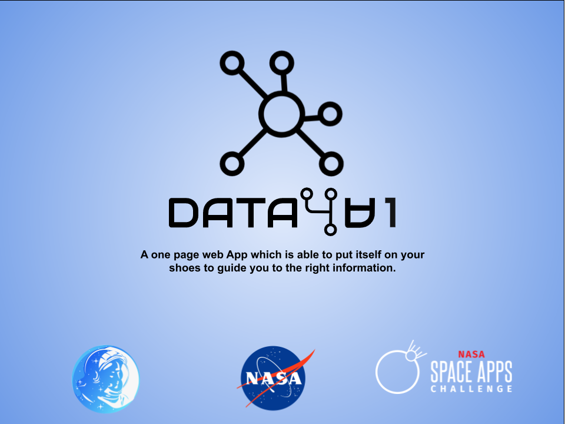
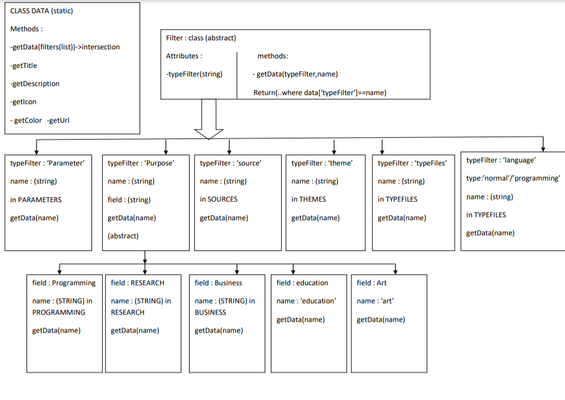
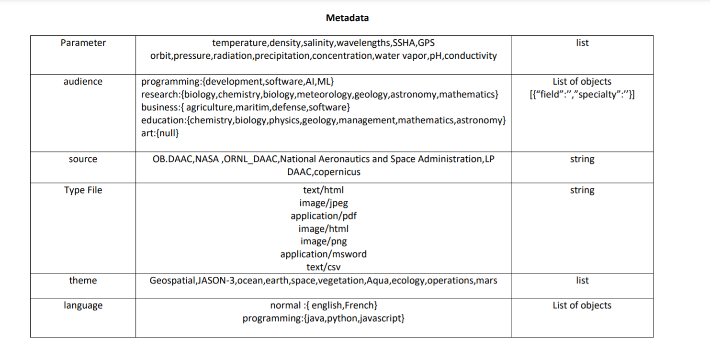
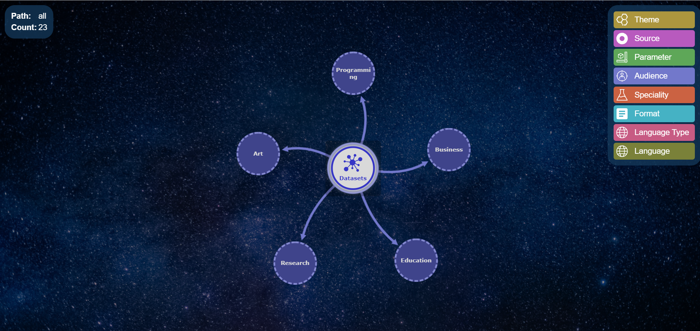
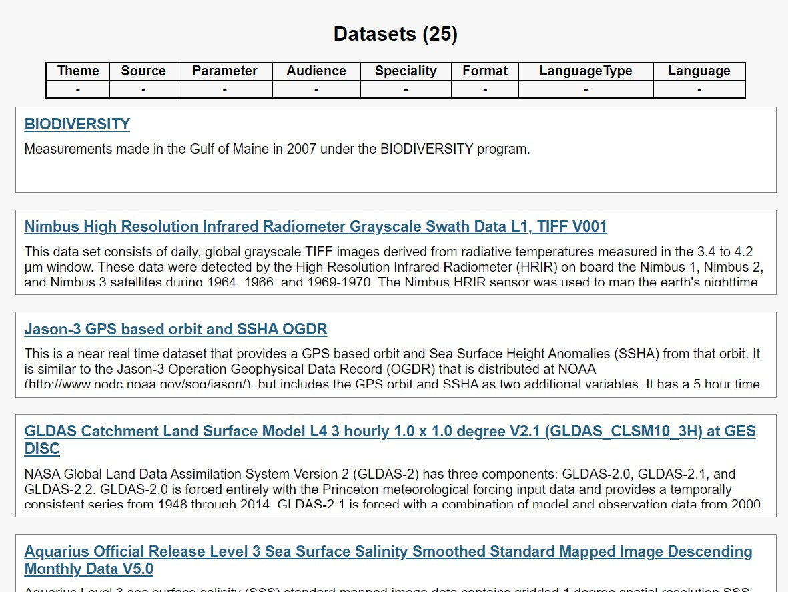

# DATA4∀1
This repo was used to support [our idea](https://2021.spaceappschallenge.org/challenges/statements/ontologies-and-interactive-network-visualizations/teams/aiacspace) for the [NASA Space Apps Challenge 2021](https://2021.spaceappschallenge.org/).



### Ontology
To build this project the following ontology was designed



### Metadata
From the Following ontology the metadata of the data will be as follows




### Dataset
The dataset used is the [Nasa portal data](https://data.nasa.gov/data.json), offered by the [Nasa](https://www.noaa.gov/) agency. The project uses a [restricted version with some added attributes](https://firebasestorage.googleapis.com/v0/b/speedlearning-fbd64.appspot.com/o/30-datasets-1.json?alt=media&token=0312d16d-22ad-4387-b817-21cc73669aac). Those attributes were added according to the metadata that was shown previously.

### Install
```bash
git clone https://github.com/khadijalahy1/NasaSpaceApps2021-aiacSpace.git
cd app
npm install 
```

### Run
```bash
cd app
node index.js
```


-------------------------------------------------------------------

# Project infos
We aim to guide the user through his journey of searching for data step by step until getting the exact data that'll meet his need.


**THE PROBLEM**
With the big amount of data that is available on the Net , many users either searchers,students, business-man or artists are struggling to find rapidly the data that they will meet their needs .


**OUR SOLUTION : HOW IT WORKS?**
Analyzing NASA and other agencies data we've found that all the data that is available can be filtered following the ontology that is displayed below .So at each step the user have to choose the type of the filter that will meet his need then choose one of the options that will be displayed on the screen . After that, the user will either stop on this stage and move on with displaying the data or he will choose to apply an other filter to his data to get more precise results.


**IMPLEMENTATION**
DATA4∀1 is a webApp which is displaying all the filters that the user will need through a network  visualization.





**REFERENCES**
- OSMC - NOAA: https://bit.ly/2N1hZ7E
- NASA SVS Garbage Patch: https://go.nasa.gov/2O7tyJM 
- Nasa portal: https://data.nasa.gov


**SLIDES (IN ITALIAN)**
- [Google Slides](https://docs.google.com/presentation/d/1eF7N_hRMlZYtYcyZvL7i-_9NULhR5TM8qQzK-EJ2-ZE/edit?usp=sharing)
- [Video Rendering](./assets/video/rendering.mp4)
